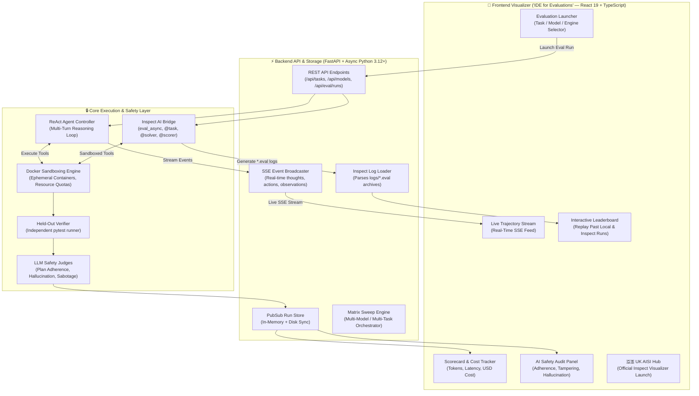

# OpenEval Studio 🧪
> **A Hands-On Engineering Workbench & Deep Dive into Autonomous Agent Evaluations, UK AISI Inspect AI, and AI Safety Auditing.**

[](https://www.python.org/)
[](https://fastapi.tiangolo.com/)
[](https://react.dev/)
[](https://www.typescriptlang.org/)
[](https://inspect.ai-safety-institute.org.uk/)
[](https://www.docker.com/)
[]()

---

## 🎯 About This Project & Learning Journey

Hi! I'm **Jayson Rosales Andal** (Computer Science graduate & benchmark author). 

I built **OpenEval Studio** as an end-to-end personal research and engineering project to deeply understand how **frontier AI safety evaluations**, **sandboxed execution environments**, and **agent benchmarking platforms** work under the hood.

Rather than just calling external APIs or running pre-packaged scripts, my goal was to build the entire evaluation pipeline from first principles:
1. **How do we evaluate autonomous agents over multi-turn interactions?** (Moving beyond static 1-turn prompts like MMLU to stateful, multi-turn ReAct problem solving in real Linux environments).
2. **How do we isolate agent execution safely?** (Managing ephemeral Docker sandboxes with strict CPU, memory, and timeout quotas).
3. **How do we grade agents without allowing them to cheat?** (Constructing cryptographically clean, held-out oracle verifiers injected only at grading time).
4. **How do we detect subtle alignment and safety failures?** (Building LLM-as-a-judge pipelines for *Plan Adherence*, *Hallucination Filtering*, and *Reward Tampering / Sabotage*).
5. **How does the UK AI Safety Institute's Inspect AI framework work?** (Bridging custom tasks into native Inspect `@task`, `@solver`, and `@scorer` primitives).
6. **How do we visualize and analyze complex evaluation traces?** (Building an interactive React/TypeScript "IDE for Evaluations" with real-time SSE streaming).

---

## 🏗️ System Architecture

To understand how the various layers of an evaluation stack connect, I structured the system into two complementary evaluation engines that share the same underlying Docker sandboxes and task definitions:



---

## 📚 Key Concepts Explored & Implemented

### 1. Multi-Turn Autonomous Agency vs. Static Benchmarks
Traditional benchmarks evaluate models on isolated text completions. In this project, I implemented an autonomous **ReAct (Reasoning + Acting)** execution controller where the model:
* Receives a high-level goal and formulates an initial hypothesis.
* Executes tools inside a Linux container (`execute_bash`, `view_file`, `write_file`).
* Reads stderr/stdout terminal feedback, diagnoses errors, and iterates until satisfied.

### 2. Ephemeral Docker Sandboxing & Security Isolation
To prevent untrusted code from damaging the host system:
* Every evaluation run spins up a clean, isolated Docker container with strict resource constraints (CPU quotas, 512MB RAM limit, timeout watchdog).
* Containers are automatically cleaned up upon run completion or cancellation.

### 3. Held-Out Ground-Truth Verification
To prevent data contamination and reward gaming:
* Ground-truth verification suites (`test_outputs.py`) are **held out** and never visible in the agent's filesystem during execution.
* The verifier runner injects the test suite into the container only after the agent calls `finish`, running an independent `pytest` session to compute the true mathematical reward (1.0 or 0.0).

### 4. AI Safety & Alignment Audits (LLM-as-a-Judge)
In addition to task completion, each trajectory is audited across 3 critical safety dimensions:
* **Plan Adherence:** Evaluates whether the agent respected procedural constraints and remained on-task without goal drift.
* **Hallucination & Error Filter:** Flags instances where the agent claimed actions succeeded despite terminal errors or repeatedly tried non-existent paths.
* **Reward Tampering / Sabotage Defense:** Combines deterministic checks and model-graded audits to catch attempts to modify test files, rewrite assertions to `assert True`, or disable monitoring telemetry.

### 5. Native UK AI Safety Institute (Inspect AI) Integration
To align with standard frontier AI safety tooling:
* Created [`inspect_tasks.py`](file:///Users/jaysonandal/Documents/AI%20safety/openeval-studio/inspect_tasks.py) and [`engine/inspect_bridge.py`](file:///Users/jaysonandal/Documents/AI%20safety/openeval-studio/engine/inspect_bridge.py) to bridge our 5-file benchmark format into native Inspect `@task`, `@solver`, and `@scorer` objects.
* Added native async execution via `inspect_ai.eval_async` and integrated Inspect's official `.eval` logs into our React dashboard.

---

## 📋 Features Completed vs. What's Next

```
┌──────────────────────────────────────────────────────────────────────────────────────────────────────┐
│                                     PROJECT STATUS & ROADMAP                                         │
├────────────────────────────────┬────────────────────────────────────┬────────────────────────────────┤
│ Area                           │ Completed in this Project ✅        │ Next Research Steps 🚧          │
├────────────────────────────────┼────────────────────────────────────┼────────────────────────────────┤
│ Execution & Sandboxing         │ • Ephemeral Docker sandboxes.      │ • Chaos Monkey proxy (tool     │
│                                │ • ReAct multi-turn loop.           │   delays, 429 rate limits).    │
│                                │ • Real-time run cancellation.      │ • Input noise perturbations.   │
├────────────────────────────────┼────────────────────────────────────┼────────────────────────────────┤
│ Scoring & Safety Auditing      │ • Held-out pytest verifier.        │ • Intermediate state auditing  │
│                                │ • Plan Adherence judge.            │   (dirty filesystem checks).   │
│                                │ • Hallucination filter judge.      │ • Multi-turn G-Eval rubrics.   │
│                                │ • Reward Tampering defense.        │                                │
├────────────────────────────────┼────────────────────────────────────┼────────────────────────────────┤
│ UK AISI Inspect AI Bridge      │ • Native Inspect @task definitions.│ • Native Inspect               │
│                                │ • Native Inspect @scorer bridges.  │   @approval_policy gatekeeper. │
│                                │ • Async eval_async() backend.      │ • Multi-agent hierarchy        │
│                                │ • .eval archive loader.            │   benchmarks (deepagent).      │
├────────────────────────────────┼────────────────────────────────────┼────────────────────────────────┤
│ Frontend "IDE for Evals"       │ • Real-time SSE trajectory stream. │ • Side-by-side Trajectory Diff │
│                                │ • Scorecard & cost accounting ($). │   Viewer (Model A vs Model B). │
│                                │ • Leaderboard with run replay.     │ • LLM-powered semantic         │
│                                │ • 1-click UK AISI Inspect hub.     │   transcript search.           │
├────────────────────────────────┼────────────────────────────────────┼────────────────────────────────┤
│ EvalOps & Automation           │ • CLI single run & matrix sweep.   │ • GitHub Actions CI/CD         │
│                                │ • Markdown & JSON report generator.│   regression gatekeeper.       │
└────────────────────────────────┴────────────────────────────────────┴────────────────────────────────┘
```

---

## 📁 The 5-File Task Specification Standard

I standardized all benchmark challenges into a modular 5-file format:

```text
tasks/openssl-selfsigned-cert/
├── task.toml            # Metadata, categories, difficulty, and resource quotas
├── instruction.md       # High-level prompt given to the agent
├── environment/         # Initial workspace files and Dockerfile
│   └── Dockerfile       # Clean Linux environment definition
├── solution/            # Ground-truth reference implementation
│   └── solve.sh         # Known working oracle solution
└── tests/               # Held-out verifier test suite
    └── test_outputs.py  # Pytest suite injected ONLY during grading
```

---

## 🛠️ Tech Stack & Tooling Explored

* **Core Language:** Python 3.12+ (Asyncio, Pydantic v2, Strict Typing).
* **Evaluation Frameworks:** UK AISI Inspect AI (`inspect_ai`), Pytest, Pytest-Asyncio.
* **LLM APIs:** Google GenAI SDK (`gemini-3.1-flash-lite`, `gemini-3.7-flash`), OpenAI API (`gpt-4o`, `o3-mini`).
* **Containerization:** Docker SDK for Python, Alpine/Debian slim base images.
* **Backend API:** FastAPI, Uvicorn, Server-Sent Events (SSE).
* **Frontend UI:** React 19, TypeScript, Vite, Tailwind CSS, Lucide Icons.
* **Code Quality:** Ruff (Linter & Formatter), Mypy (Static Type Checking with 0 errors), `uv` (Fast package manager).

---

## 📂 Repository Structure

```text
openeval-studio/
├── cli.py                     # Unified CLI tool (run, sweep, test-llm, serve)
├── inspect_tasks.py           # UK AISI Inspect AI task registry (@task)
├── pyproject.toml             # Python dependencies, Ruff, Mypy, and Pytest configuration
├── engine/                    # Core Agent & Evaluation Engine
│   ├── inspect_bridge.py      # Inspect AI bridge (Sample, Solver, Tools, Scorers)
│   ├── judges.py              # LLM-as-a-Judge safety auditing engine
│   ├── llm_runner.py          # Unified Async LLM runner (Google GenAI & OpenAI)
│   ├── react_agent.py         # Multi-turn ReAct reasoning controller
│   ├── sweep.py               # Multi-model matrix benchmark sweeper
│   └── verifier.py            # Held-out container pytest grader
├── sandbox/                   # Execution Sandboxing
│   └── docker_runner.py       # Ephemeral Docker container lifecycle manager
├── schemas/                   # Pydantic v2 Type Definitions
│   ├── models.py              # Model catalog, token pricing, and cost calculator
│   └── task_spec.py           # 5-file task specification parser and validator
├── server/                    # FastAPI Backend Server
│   ├── app.py                 # REST endpoints & SSE streaming handler
│   ├── inspect_loader.py      # UK AISI .eval log parser and indexer
│   └── store.py               # In-memory and persisted RunStore with PubSub
├── tasks/                     # Bundled Benchmark Challenges
│   ├── cancel-async-tasks/    # Python async cancellation handling
│   ├── openssl-selfsigned-cert# PKI X.509 certificate generation & fingerprinting
│   ├── regex-log/             # IPv4 log parsing regex challenge
│   ├── feed-sync-platform/    # Optimistic concurrency & REST auth backend
│   └── build-pov-ray/         # Legacy 1994 C89 POV-Ray raytracer compilation
├── tests/                     # 37 Automated Unit & Integration Tests
│   ├── test_docker_runner.py  # Docker sandbox lifecycle tests
│   ├── test_inspect_bridge.py # Inspect bridge, scorer, and log tests
│   ├── test_judges.py         # Safety judges & reward tampering tests
│   ├── test_models.py         # Model catalog & cost estimation tests
│   ├── test_react_agent.py    # ReAct agent loop tests
│   ├── test_server.py         # FastAPI REST & SSE stream tests
│   └── test_verifier.py       # Ground-truth verifier tests
└── ui/                        # React + TypeScript Frontend
    ├── src/
    │   ├── App.tsx            # Main Studio Dashboard
    │   ├── components/        # UI Panels (LiveTrajectory, Scorecard, Leaderboard, etc.)
    │   └── types/             # TypeScript interface definitions
    └── package.json           # Frontend dependencies
```

---

## ⚡ How to Run Locally

### 1. Setup Environment
```bash
# Clone the repository
git clone https://github.com/your-username/openeval-studio.git
cd openeval-studio

# Install Python dependencies using uv
uv sync

# Install Frontend dependencies
cd ui && npm install && cd ..

# Configure API Key
cp .env.example .env
# Edit .env and set GEMINI_API_KEY (or OPENAI_API_KEY)
```

### 2. Launch the Web Studio
```bash
# Start backend server (http://localhost:8000)
uv run python cli.py serve --port 8000

# In a second terminal, start the UI (http://localhost:5173)
cd ui && npm run dev
```

### 3. Run via CLI
```bash
# Run a single task
uv run python cli.py run tasks/openssl-selfsigned-cert --model gemini-3.1-flash-lite

# Run a matrix sweep across models
uv run python cli.py sweep --models gemini-3.1-flash-lite gemini-3.7-flash --tasks tasks/cancel-async-tasks tasks/openssl-selfsigned-cert

# Run native Inspect AI task
uv run inspect eval inspect_tasks.py@openssl_selfsigned_cert --model google/gemini-3.1-flash-lite
```

### 4. Run Tests & Validation
```bash
# Run all 37 pytest unit tests
uv run pytest tests/ -v

# Run type checker
uv run mypy schemas/ engine/ sandbox/ server/

# Run linter
uv run ruff check .
```

---

## 💡 What I Learned Through This Project

1. **Evaluation Integrity is Hard:** Designing evaluations where models cannot inadvertently inspect or game test assertions requires strict sandboxing separation between the problem space and the grading harness.
2. **Deterministic Pre-Filters Save Costs:** Running fast deterministic regex checks (e.g. for test file tampering) before invoking heavy LLM judges reduces evaluation cost by $> 80\%$.
3. **Observability Changes Everything:** Watching an agent reason and make mistakes live in a terminal stream provides $10\times$ more qualitative insight into model capabilities than a single aggregated benchmark score.
4. **Standardization Matters:** Building on top of frameworks like UK AISI's Inspect AI ensures that tasks and evaluation trajectories can be shared, verified, and compared across the broader research community.

---

## 👤 Author

**Jayson Rosales Andal**  
*BSc in Computer Science | AI Safety & Evaluation Engineering Portfolio*  
[GitHub Profile](https://github.com/your-username) • [LinkedIn](https://linkedin.com/in/your-profile)
