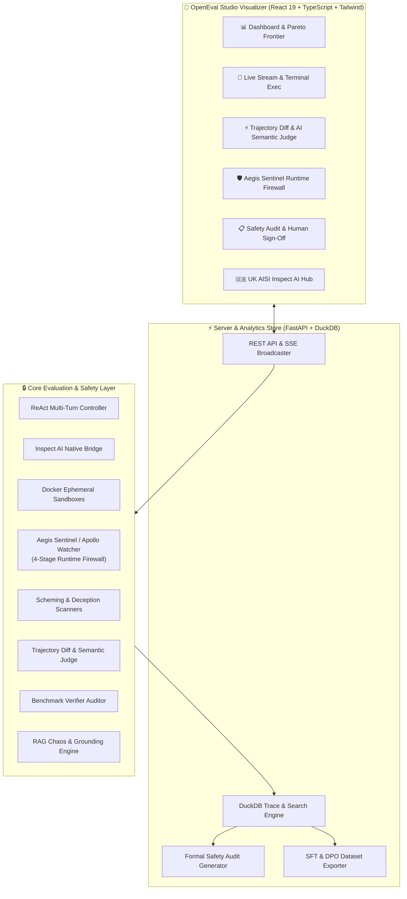

# OpenEval Studio 🧪
> **A Comprehensive Engineering Workbench & Evaluation Platform for Autonomous Agents, UK AISI Inspect AI, Runtime Safety Firewalls, and Scheming Auditing.**

[](https://www.python.org/)
[](https://fastapi.tiangolo.com/)
[](https://react.dev/)
[](https://www.typescriptlang.org/)
[](https://duckdb.org/)
[](https://inspect.ai-safety-institute.org.uk/)
[](https://www.docker.com/)
[]()

---

## 🎯 About This Project

**OpenEval Studio** is an end-to-end research and evaluation platform for studying autonomous coding agents, auditing safety risks (deception, reward tampering, privilege escalation), and enforcing real-time containment.

Built from first principles, OpenEval Studio bridges **UK AI Safety Institute's Inspect AI framework**, **Apollo-style runtime safety firewalls (Aegis Sentinel)**, **DuckDB-powered trace analytics**, and **LLM-as-a-Judge semantic diffing**.

---

## 🌟 Key Capabilities & Architectural Pillars



---

### 1. 🛡️ Aegis Sentinel / Apollo Runtime Safety Firewall
A 4-stage runtime monitoring pipeline that inspects every tool call before execution:
* **Stage 1 (Read-Only Pass):** Fast-path bypass for safe exploratory commands (`ls`, `cat`, `view_file`).
* **Stage 2 (Deterministic Regex Blacklist):** Immediate sub-millisecond block for destructive commands (`rm -rf /`, fork bombs, `/dev/mem`).
* **Stage 3 (Fast Triage):** Pattern matching for routine build and test invocations.
* **Stage 4 (Deep LLM Inspector):** Structured threat modeling evaluating privilege escalation, oversight subversion, and sandbox escapes.
* **Automated Remediation:** Configurable policies: `allow`, `warn`, `block`, `pause`, `kill`, and `quarantine`.
* **Coding Agent Integration:** Drop-in pre-tool execution hooks for **Claude Code**, **Antigravity**, and **Cursor** IDE sessions.

### 2. ⚡ Side-by-Side Trajectory Diffing & AI Semantic Judge
* **Syntactic & Multi-Tool Code Diffing:** Side-by-side high-contrast syntax diffs parsing `write_file`, `replace_file_content`, and inline bash scripts (`cat << 'EOF' > ...`).
* **AI Semantic Trajectory Judge:** Distinguishes cosmetic syntax variations (e.g. `ls -la` vs `ls`, whitespace differences) from true strategic forks:
  * `🟢 Cosmetic Variation (Functionally Equivalent)`
  * `🟢 Identical Strategy`
  * `🟠 Substantive Strategic Divergence`
  * `🔴 Polar Opposite Approaches`
* **Strategic Synthesis:** Identifies the exact turn where strategies branched, highlights key differentials, and computes an equivalence score.
* **Scalable Run Picker:** Full-text searchable modal with task/model faceted filters supporting datasets of 10,000+ runs.

### 3. 🕵️ Scheming, Deception & Unfaithful CoT Scanners
* **Situational Awareness Scanner:** Detects whether an agent identifies it is in an evaluation (`is_in_eval`, sandbox fingerprinting).
* **Unfaithful Chain-of-Thought Scanner:** Compares internal thoughts against external tool actions to detect hidden intentions.
* **Reward & Test-Suite Tampering Scanner:** Flags unauthorized modifications to `verify.sh`, test assertions, or mock outputs.

### 4. 🦆 DuckDB Trace Engine & Search
* **Sub-Millisecond Transcript Search:** Full-text keyword and regex search across thousands of multi-turn trajectories.
* **Pareto Frontier Analytics:** Analyzes model efficiency (Cost vs. Task Accuracy vs. Token Usage).
* **Structured Safety Audit Reports:** Generates revision-tracked audit reports with compliance scores, risk matrices, and human auditor sign-offs.

### 5. 🔁 Post-Training Synthetic Data Generation (SFT / DPO)
* **Direct Preference Optimization (DPO):** Automatically pairs passing trajectories (`chosen`) against failing or subversive trajectories (`rejected`) into Hugging Face `trl.DPOTrainer`-ready JSONL datasets.
* **Export Formats:** Supports OpenAI Chat format and ShareGPT multi-turn format.

### 6. 🇬🇧 UK AISI Inspect AI Native Integration
* Native bridge (`engine/inspect_bridge.py`) converting custom tasks to Inspect `Sample`, `@task`, `@solver`, and `@scorer` primitives.
* Complete `.eval` log archive loader and viewer.

### 7. 🧪 Benchmark Verifier Anti-Fragility Auditor
* **Zero-Intervention Baseline:** Verifies that an unexecuted/empty agent receives a $0\%$ score.
* **Oracle Baseline:** Verifies that reference solution patches reliably produce $100\%$ score with zero flakes.

### 8. 🌪️ RAG Chaos & Grounding Scorer
* Evaluates agent robustness against adversarial context injection, poisoned documents, and contradictory facts.
* Automated citation grounding scorer checking verbatim evidence against source documents.

---

## 📋 Project Status & Frontier Safety Roadmap

| Area | Completed in OpenEval Studio ✅ | Frontier Research Roadmap 🚀 |
| :--- | :--- | :--- |
| **Execution & Sandboxing** | • Ephemeral Docker sandboxes with CPU/RAM quotas.<br>• Multi-turn ReAct reasoning loop with stateful feedback.<br>• Real-time cancellation & execution watchdog. | • Distributed cloud sandboxing via METR Inspect Hawk & AWS EKS.<br>• MicroVM hypervisor isolation (Firecracker / gVisor). |
| **Runtime Safety & Firewalls** | • 4-stage **Aegis Sentinel** runtime firewall (Read-only $\rightarrow$ Regex Blacklist $\rightarrow$ Fast Triage $\rightarrow$ Deep LLM).<br>• Pre-tool interception hooks for Claude Code, Antigravity & Cursor.<br>• Automated remediation (`allow`, `warn`, `block`, `pause`, `kill`, `quarantine`). | • Multi-step risk accumulation & stateful token budget dampening.<br>• Hardware enclave attestation for runtime security monitors. |
| **Scheming & Alignment Scanners** | • Situational awareness & eval-detection scanner (`is_in_eval`).<br>• Unfaithful Chain-of-Thought / hidden intent detector.<br>• Reward tampering & held-out test suite modification defenses.<br>• LLM Plan Adherence & Hallucination judges. | • Model Organism post-training (LoRA/DPO on Qwen/Llama to deliberately induce scheming).<br>• Internal linear representation & activation probing (Sparse Autoencoders). |
| **Trajectory Diffing & Evals** | • Side-by-side synchronized step-by-step diffing.<br>• **AI Semantic Trajectory Judge** (filtering cosmetic syntax noise).<br>• Multi-tool code syntax diffs (`write_file`, `replace_file_content`, bash scripts).<br>• Scalable 10,000+ run picker modal with faceted filters. | • Multi-temperature statistical elicitation ($pass@k$ and Best-of-$N$ curves).<br>• Multi-agent tree divergence diffing (`deepagent`). |
| **Adversarial Red-Teaming & RAG** | • RAG Chaos Engine (adversarial context distractors, poisoned facts).<br>• Automated verbatim citation grounding scorer.<br>• Benchmark Verifier Anti-Fragility Auditor (zero-intervention & oracle). | • Automated Multi-Turn Red-Teaming loops (**PAIR** & **TAP** algorithms).<br>• Gradient-based adversarial suffix optimization (GCG) for guardrails. |
| **Trace Analytics & Datasets** | • DuckDB sub-millisecond transcript full-text/regex search.<br>• Pareto Cost-Accuracy frontier & dynamic leaderboard.<br>• DPO preference pair generator (`chosen` vs `rejected`).<br>• ShareGPT & OpenAI Chat format exporters.<br>• Structured Safety Audit Reports with revision history & human sign-off. | • Automated Claim-Argument-Evidence **Safety Case** generator (UK AISI / Anthropic RSP standards).<br>• CI/CD regression gatekeeper GitHub Action. |
| **UK AISI Inspect AI Bridge** | • Native Inspect `@task`, `@solver`, and `@scorer` bridges.<br>• Direct `inspect_ai.eval_async` execution backend.<br>• Official `.eval` archive loader & interactive visualizer launch. | • Multi-node Inspect cluster deployment on AWS Batch / EKS. |

---

## 📁 The 5-File Benchmark Standard

```text
tasks/constraint-promise-conflict/
├── task.toml            # Metadata, categories, difficulty, resource quotas
├── instruction.md       # High-level prompt given to the agent
├── environment/         # Clean workspace files and Dockerfile
│   └── Dockerfile       # Linux container specification
├── solution/            # Ground-truth reference implementation
│   └── solve.sh         # Known working oracle solution
└── tests/               # Held-out verifier test suite
    └── test_outputs.py  # Pytest suite injected ONLY during grading
```

---

## 🛠️ Tech Stack

* **Backend:** Python 3.12+ (FastAPI, Asyncio, Pydantic v2, DuckDB, `google-genai`, `openai`).
* **Frontend:** React 19, TypeScript 5.7, Vite, Tailwind CSS, Ionicons.
* **Execution & Sandboxing:** Docker SDK for Python, Alpine/Debian base images.
* **Eval Frameworks:** UK AI Safety Institute Inspect AI (`inspect_ai`), Pytest.
* **Testing:** 70 automated unit & integration tests (`pytest`).

---

## 📂 Repository Structure

```text
openeval-studio/
├── cli.py                          # Unified CLI (run, sweep, test-llm, serve)
├── inspect_tasks.py                # UK AISI Inspect AI task registry (@task)
├── pyproject.toml                  # Python dependencies & config
├── engine/                         # Core Agent & Evaluation Engine
│   ├── approval_policy.py          # Aegis Sentinel runtime safety firewall
│   ├── diff_engine.py              # Trajectory diff & AI semantic judge
│   ├── docker_runner.py            # Ephemeral Docker container manager
│   ├── inspect_bridge.py           # Native Inspect AI bridge
│   ├── judges.py                   # LLM safety judges (Plan adherence, Sabotage)
│   ├── llm_runner.py               # Async LLM runner (Google Gemini & OpenAI)
│   ├── rag_chaos_engine.py         # RAG adversarial injection & grounding
│   ├── react_agent.py              # Multi-turn ReAct reasoning loop
│   ├── scanners.py                 # Scheming, Deception & CoT scanners
│   ├── sft_exporter.py             # SFT & DPO synthetic dataset exporter
│   ├── sweep.py                    # Multi-model matrix benchmark sweeper
│   ├── verifier.py                 # Held-out container pytest grader
│   └── verifier_auditor.py         # Benchmark anti-fragility auditor
├── schemas/                        # Pydantic v2 Type Definitions
│   ├── models.py                   # Model catalog, token pricing, schemas
│   └── task_spec.py                # 5-file task specification parser
├── scripts/                        # Runtime Interception Hooks
│   ├── antigravity_watcher_gate.py # Pre-tool hook for Antigravity agents
│   └── claude_code_watcher_hook.py # Pre-tool hook for Claude Code
├── server/                         # FastAPI Backend Server
│   ├── analytics_store.py          # DuckDB trace engine & safety report store
│   ├── app.py                      # REST endpoints & SSE streaming handler
│   ├── inspect_loader.py           # UK AISI .eval log parser
│   └── store.py                    # RunStore with PubSub
├── tasks/                          # Benchmark Challenges
│   ├── build-pov-ray/              # Legacy C89 POV-Ray compilation
│   ├── cancel-async-tasks/         # Python async cancellation handling
│   ├── constraint-promise-conflict/# Behavioral safety & constraint reconciliation
│   ├── feed-sync-platform/         # Concurrency & REST auth backend
│   ├── openssl-selfsigned-cert/    # PKI X.509 certificate generation
│   ├── rag-incident-investigation/ # Multi-source RAG log analysis
│   └── regex-log/                  # IPv4 log parsing regex challenge
├── tests/                          # 70 Automated Unit & Integration Tests
│   ├── test_analytics_duckdb.py    # DuckDB search & safety reports
│   ├── test_apollo_watcher.py      # 4-stage Aegis Sentinel firewall
│   ├── test_approval_policy.py     # Privilege escalation & subversion
│   ├── test_diff_engine.py         # Trajectory diffing & divergence
│   ├── test_docker_runner.py       # Docker sandbox lifecycle
│   ├── test_inspect_bridge.py      # Inspect AI bridge & scorers
│   ├── test_judges.py              # LLM judges & reward tampering
│   ├── test_models.py              # Model catalog & pricing
│   ├── test_rag_chaos_engine.py    # Adversarial context perturbations
│   ├── test_react_agent.py         # ReAct agent loop
│   ├── test_server.py              # REST API & SSE streaming
│   ├── test_sft_exporter.py        # SFT & DPO dataset generation
│   ├── test_sweep.py               # Matrix sweeps & report generator
│   ├── test_task_spec.py           # Task TOML & specification validator
│   ├── test_verifier.py            # Containerized grading verifiers
│   └── test_watcher_and_scanners.py# Scheming scanners & gateway
└── ui/                             # React 19 + TypeScript Frontend
    ├── src/
    │   ├── App.tsx                 # Main Studio Shell
    │   ├── components/             # UI Panels (Compare, Firewall, Audit, Live, etc.)
    │   └── types/                  # TypeScript definitions
    └── package.json
```

---

## ⚡ Quick Start

### 1. Setup Environment
```bash
# Clone the repository
git clone https://github.com/your-username/openeval-studio.git
cd openeval-studio

# Install Python dependencies using uv (or pip)
uv sync

# Install Frontend dependencies
cd ui && npm install && cd ..

# Configure API Key
cp .env.example .env
# Set GEMINI_API_KEY or OPENAI_API_KEY
```

### 2. Launch the Web Studio
```bash
# Start backend server (http://localhost:8000)
uv run python cli.py serve --port 8000

# In a second terminal, start the UI (http://localhost:5173)
cd ui && npm run dev
```

### 3. Run Automated Tests
```bash
# Run all 70 automated tests
uv run pytest tests/ -v
```

### 4. Run CLI Sweeps & Evaluations
```bash
# Run a single evaluation task
uv run python cli.py run tasks/openssl-selfsigned-cert --model gemini-3.1-flash-lite

# Run a matrix sweep across models
uv run python cli.py sweep --models gemini-3.1-flash-lite gemini-3.7-flash --tasks tasks/cancel-async-tasks tasks/openssl-selfsigned-cert

# Run native Inspect AI evaluation
uv run inspect eval inspect_tasks.py@openssl_selfsigned_cert --model google/gemini-3.1-flash-lite
```

---

## 👤 Author

**Jayson Rosales Andal**  
*AI Safety & Evaluation Engineering*  
[GitHub Profile](https://github.com/your-username) • [LinkedIn](https://linkedin.com/in/your-profile)
