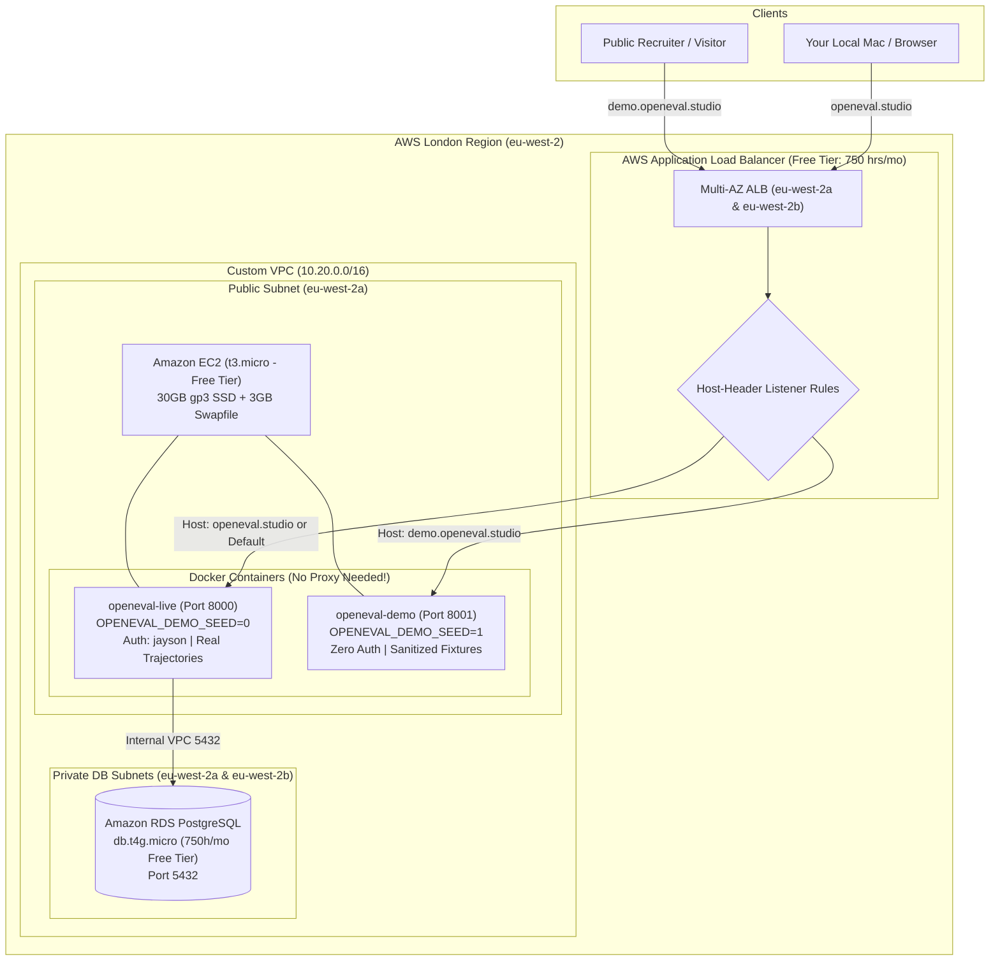

# AWS Production Deployment Guide (London `eu-west-2`)

Complete guide to deploying OpenEval Studio to AWS using **Terraform (IaC)**, **AWS Application Load Balancer (ALB)**, **Amazon RDS for PostgreSQL**, and **Docker Compose**, operating within the AWS Free Tier and your $100–$200 credits.

---

## 1. Architecture Topology



---

## 2. Step-by-Step Deployment

### Step 1: Provision Infrastructure with Terraform
From your local terminal:
```bash
cd terraform/aws

# 1. Initialize Terraform provider
terraform init

# 2. Preview the plan
terraform plan

# 3. Apply infrastructure (creates VPC, Subnets, ALB, RDS, EC2, Elastic IP)
terraform apply
```
*Note: Amazon RDS and ALB typically take 5–8 minutes to initialize.*

When `terraform apply` finishes, note the outputs:
- `alb_dns_name`: Public DNS of the AWS Application Load Balancer.
- `alb_preview_url`: Direct HTTP preview URL to test right away.
- `ec2_ssh_command`: SSH command to connect to your instance.
- `rds_database_url`: PostgreSQL connection string for the backend.

---

### Step 2: SSH into the Provisioned EC2 Instance
```bash
ssh -i ~/.ssh/id_ed25519 ubuntu@<EC2_PUBLIC_IP>
```

Verify Docker and swap:
```bash
docker --version
free -h   # Should show 1GB RAM + 3GB Swap!
```

---

### Step 3: Clone the Repository & Configure `.env`
```bash
git clone https://github.com/UnAnPH/openeval-studio.git
cd openeval-studio
```

Create your production `.env` file:
```bash
cat << 'EOF' > .env
# Authentication for openeval.studio
ADMIN_USER=jayson
ADMIN_PASSWORD=your_secure_password_here

# Security & Watcher Webhooks
OPENEVAL_API_KEY=your_secret_watcher_token_12345
GEMINI_API_KEY=your_google_gemini_api_key
OPENEVAL_WATCHER_USE_LLM=1

# Amazon RDS PostgreSQL Database URL (retrieve via: terraform output -raw rds_database_url)
DATABASE_URL=postgresql://openeval:<generated-password>@openeval-postgres.cxxxx.eu-west-2.rds.amazonaws.com:5432/openeval
EOF
```

---

### Step 4: Launch OpenEval Containers
```bash
docker compose -f docker-compose.prod.yml up -d --build
```

Verify both containers are running:
```bash
docker compose -f docker-compose.prod.yml ps
```

---

### Step 5: Test the Deployment Immediately
Even before you claim your domain on Name.com, you can test directly via the **ALB DNS Name** or **EC2 Public IP**:
- **Direct Live Studio:** `http://<ALB_DNS_NAME>` (prompts for user `jayson` and password)
- **Direct Public Demo:** `http://<EC2_PUBLIC_IP>:8001` (zero login, demo fixtures)

---

### Step 6: Configure Domain DNS on Name.com (Once Claimed)
In your Name.com DNS Management console:
1. Add a **CNAME** record:
   - **Type:** `CNAME` | **Host:** `@` | **Answer:** `<ALB_DNS_NAME>`
2. Add a **CNAME** record:
   - **Type:** `CNAME` | **Host:** `demo` | **Answer:** `<ALB_DNS_NAME>`
3. Set TTL to `300` (5 minutes).

---

### Step 7: Connect Your Local Mac IDE to the Cloud
On your local machine, add these lines to your `~/.zshrc`:
```bash
export OPENEVAL_WATCHER_URL="http://<ALB_DNS_NAME>/api/watcher/evaluate"
export OPENEVAL_API_KEY="your_secret_watcher_token_12345"
```
Test the connection:
```bash
python3 scripts/test_cloud_watcher.py http://<ALB_DNS_NAME> your_secret_watcher_token_12345
```
