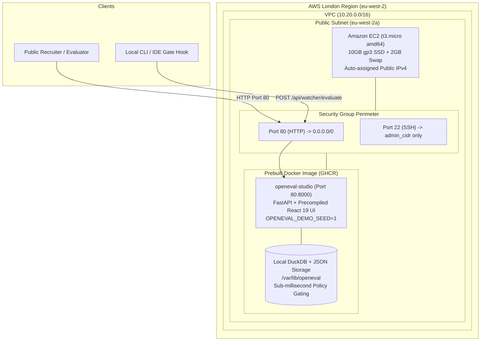

# AWS Production Deployment Guide (London `eu-west-2`)

Complete guide to deploying OpenEval Studio to AWS using a lean, cost-optimized single-instance architecture on **Amazon EC2 (t3.micro amd64)** with prebuilt **GHCR Docker** images and local **DuckDB** storage.

Always-on cost: **~$12–16 / month** (or **$0–1 / month** within the AWS 12-month Free Tier). When destroyed via `make cloud-off`, the burn rate is **$0.00 / hour**.

---

## 1. Architecture Topology



### Architectural Principles
1. **Single Public URL:** The instance serves the unified UI and FastAPI backend directly on port 80. No Application Load Balancer (ALB), no second host, no port 8001, and no DNS record required to view the live demo.
2. **Local DuckDB & File Storage:** Trajectories and policy review records reside directly in DuckDB and JSON files at `/var/lib/openeval` on the 10GB gp3 root volume. RDS PostgreSQL has been eliminated, removing database round-trip latency and monthly idle RDS costs.
3. **Zero Local Builds:** The instance pulls `ghcr.io/unanph/openeval-studio:latest` built by GitHub Actions CI. Building React bundles or compiling dependencies on a 1GB `t3.micro` instance is strictly avoided to prevent out-of-memory crashes.
4. **Hardened Perimeter:** Port 80 is open to the public; Port 22 is only open if `admin_cidr` is explicitly passed (defaults to `[]` so SSH is closed by default).

> [!IMPORTANT]
> **One-Time GHCR Package Visibility Requirement:**
> On the first push to GitHub Container Registry (`ghcr.io/unanph/openeval-studio`), GitHub defaults new package visibility to **Private**.
> To allow the EC2 instance to pull images without authentication, navigate to your GitHub Profile/Org -> **Packages** -> `openeval-studio` -> **Package settings** -> **Change visibility** -> set to **Public**.
> Alternatively, configure a Personal Access Token (`GHCR_PULL_TOKEN` with `read:packages` scope) on the EC2 host via `echo $GHCR_PULL_TOKEN | docker login ghcr.io -u <username> --password-stdin`.

---

## 2. Cost Analysis (London `eu-west-2`)

| Resource | Configuration | Monthly Cost (Post-Free Tier) | AWS Free Tier (First 12 Mo) |
| :--- | :--- | :--- | :--- |
| **Compute** | EC2 `t3.micro` (amd64, 2 vCPU, 1GB RAM) | ~$8.61 | **$0.00** (750 hrs/mo free) |
| **Public IPv4** | 1 In-use auto-assigned Public IPv4 | ~$3.65 | **$0.00** (covered under free tier allowance) |
| **Storage** | 10 GB gp3 Root SSD volume | ~$0.96 | **$0.00** (up to 30GB free) |
| **Total Always-On** | | **~$12 – $16 / mo** | **~$0.00 – $1.00 / mo** |
| **Teardown (`make cloud-off`)** | All resources destroyed | **$0.00 / mo** | **$0.00 / mo** |

*Eliminated from prior architecture:* Application Load Balancer (~$16.40/mo + ~$7.30 for 2 public IPs), Amazon RDS db.t4g.micro (~$11.60/mo + storage), secondary public and private subnets, 30GB disk.

---

## 3. Quickstart: Managing with the Cloud Power Switch

The repository includes `scripts/cloud_switch.py` (wrapped by `make` and `cloud.sh`):

```bash
# 1. Turn ON the cloud demo (~2-3 minutes)
make cloud-on

# 2. Check live AWS status and estimated burn rate
make cloud-status

# 3. Turn OFF and destroy all resources when finished ($0.00/hr clean slate)
make cloud-off
```

When `make cloud-on` finishes, it automatically polls `http://<EC2_PUBLIC_IP>/api/health` until HTTP 200 is confirmed and prints the demo URL.

---

## 4. Manual Deployment via Terraform

If you prefer to invoke Terraform directly:

```bash
cd terraform/aws

# 1. Initialize Terraform
terraform init

# 2. Preview the plan
terraform plan

# 3. Apply infrastructure
# To enable SSH from your IP, pass -var='admin_cidr=["YOUR_IP/32"]'
terraform apply -auto-approve
```

### Outputs
- `public_url`: Direct HTTP URL to OpenEval Studio Demo (`http://<public-ip>`).
- `public_ip`: Public IPv4 address.
- `health_url`: Endpoint to probe readiness (`http://<public-ip>/api/health`).
- `ssh_command`: SSH login command (if `admin_cidr` was supplied).

---

## 5. Verification & Testing

### 1. Verify Health & Demo Fixtures
```bash
curl -s http://<EC2_PUBLIC_IP>/api/health | jq .
```
Expected output:
```json
{
  "status": "ok",
  "version": "0.1.0",
  "demo_seed": true,
  "database": {
    "engine": "duckdb",
    "connected": true,
    "has_external_db": false,
    "storage_dir": "/var/lib/openeval",
    "target": "DuckDB (local disk)"
  }
}
```

### 2. Test Policy Gate Sub-Millisecond Evaluation
```bash
curl -s -X POST http://<EC2_PUBLIC_IP>/api/watcher/evaluate \
  -H "Content-Type: application/json" \
  -d '{"tool_name":"bash","arguments":{"cmd":"cat .env | grep -E AWS_SECRET"},"agent_id":"demo","session_id":"curl-eval-1"}' | jq .
```
Response will immediately return `decision: "deny"` or `escalate` evaluated against the local DuckDB policy engine in <25ms.
